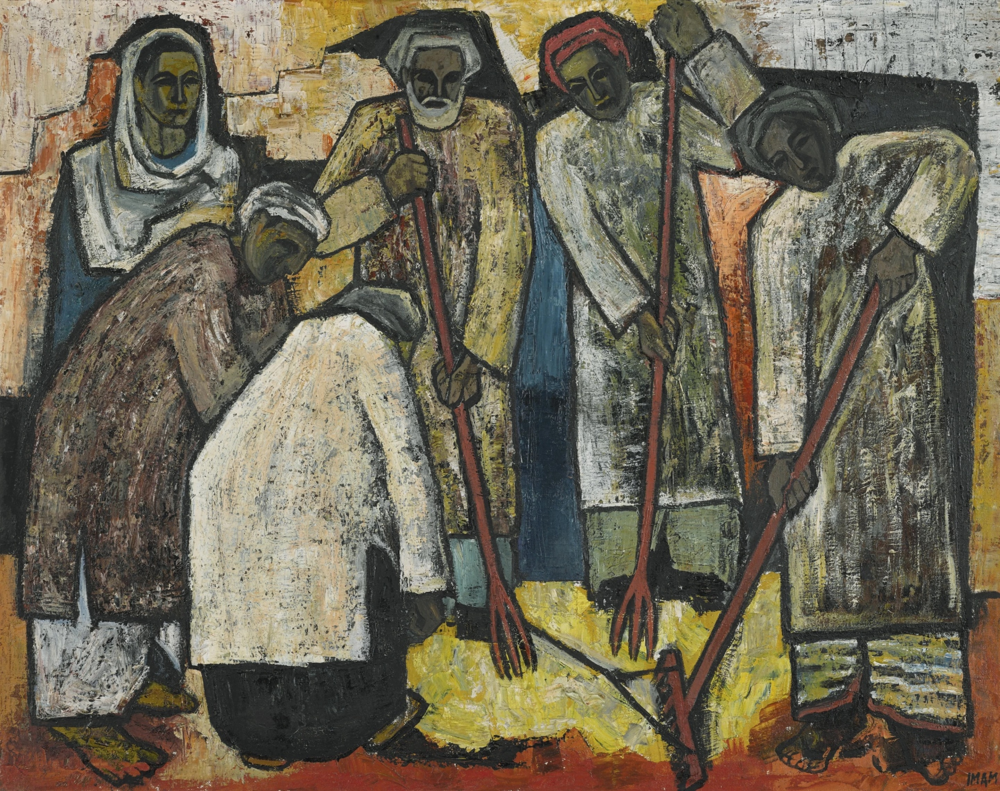

\

\

<div style= "float:left; margin-right: 40px;">
```{r, echo=FALSE, fig.algn="left", out.width="500px", fig.cap="Farmers by Ali Imam", out.extra='style="background-color: black; padding: 7px;"'}

```
</div>

\

<font size="6">Sanval Nasim</font>

<font size="5">*Assistant Professor of Economics*</font>

<font size="5">Colby College</font>

<font size="4">snasim@colby.edu</font>

<font size="4">(On sabbatical June 2023 -- August 2024)</font>
