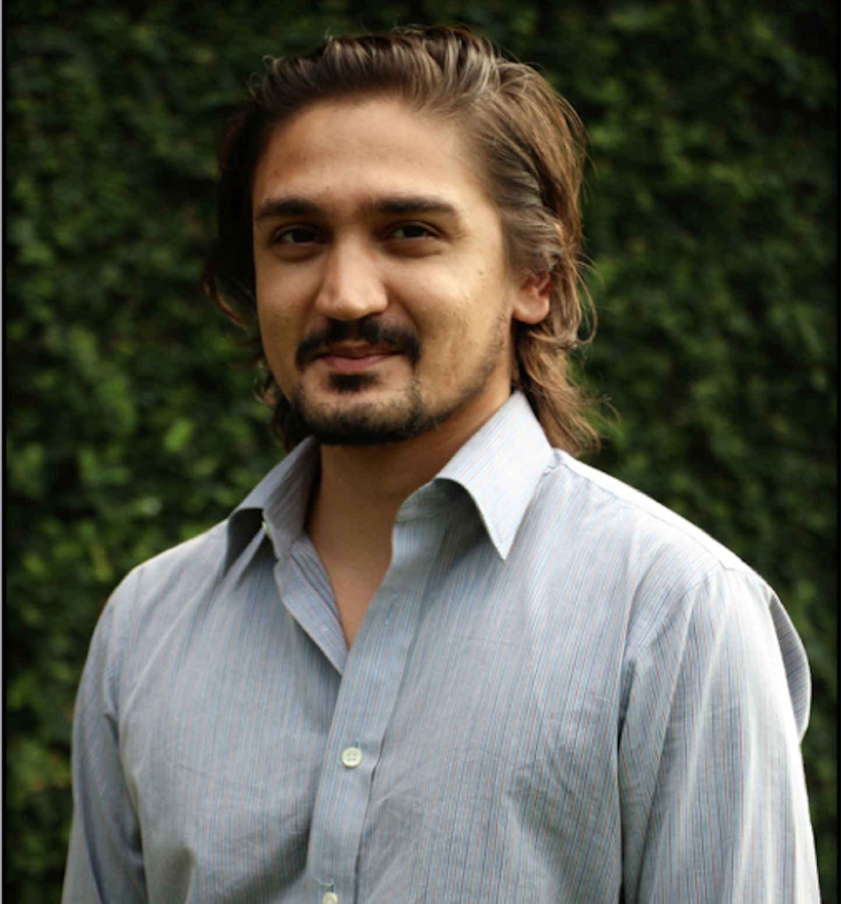

<link rel="stylesheet" href="styles.css" type="text/css">

I am an Assistant Professor of Economics at the Lahore University of Management Sciences ([LUMS](https://lums.edu.pk)). 

I research air pollution and water management using behavioral experiments, optimal control, and cost-benefit analysis.

I am also a research fellow at the Institute of Development and Economic Alternatives ([IDEAS](https://ideaspak.org)), the Mahbub ul Haq Research Centre ([MHRC](https://mhrc.lums.edu.pk)), and the Centre for Water Informatics and Technology ([WIT](https://wit.lums.edu.pk)).

I obtained my PhD in Environmental and Natural Resource Economics from the University of California, Riverside in 2015 and a BA in Economics-Mathematics and in History from Colby College in 2008.